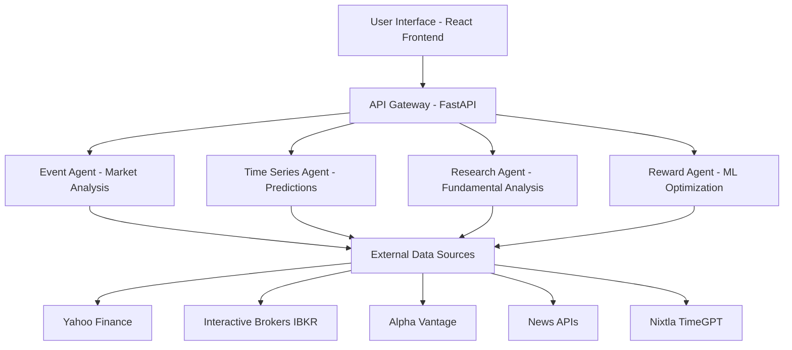

# 🧐 Finance-Bro: Complete Beginner's Guide

**A comprehensive guide to understanding and using the Finance-Bro AI-powered trading platform**

---

## 📚 Table of Contents

1. [What is Finance-Bro?](#what-is-finance-bro)
2. [System Architecture Overview](#system-architecture-overview)
3. [Backend Deep Dive](#backend-deep-dive)
4. [Frontend Deep Dive](#frontend-deep-dive)
5. [Getting Started Guide](#getting-started-guide)
6. [Key Features Explained](#key-features-explained)
7. [API Usage Examples](#api-usage-examples)
8. [Troubleshooting Common Issues](#troubleshooting-common-issues)
9. [Advanced Configuration](#advanced-configuration)
10. [Contributing and Development](#contributing-and-development)

---

## 🤔 What is Finance-Bro?

Finance-Bro is an **AI-powered financial trading platform** that combines cutting-edge machine learning, real-time market data, and automated trading strategies to help users make informed investment decisions.

### 🎯 **Core Purpose**
- **Democratize Finance**: Make sophisticated trading tools accessible to everyone
- **AI-Powered Insights**: Leverage advanced AI models for market analysis
- **Risk Management**: Provide comprehensive risk assessment and management
- **Educational**: Help users learn about finance and trading through data-driven insights

### 🏗️ **What Makes It Special**
- **Multi-Agent Architecture**: Different AI agents handle different aspects (analysis, prediction, execution)
- **Real-Time Processing**: Live market data and instant analysis
- **Advanced Time Series Modeling**: State-of-the-art forecasting using 8+ model types
- **Portfolio Optimization**: Automated portfolio balancing and risk management
- **Paper Trading**: Safe simulation environment for learning

---

## 🏛️ System Architecture Overview

### 🔄 **High-Level Architecture**



### 📦 **Component Overview**

| Component             | Purpose               | Technology                     |
| --------------------- | --------------------- | ------------------------------ |
| **Frontend**          | User Interface        | React + TypeScript + shadcn/ui |
| **Backend API**       | API Server            | FastAPI + Python               |
| **Event Agent**       | Market Analysis       | LangChain + LLMs               |
| **Time Series Agent** | Forecasting           | Nixtla + GluonTS + ML          |
| **Research Agent**    | Fundamental Analysis  | Web Scraping + NLP             |
| **Reward Agent**      | Strategy Optimization | Reinforcement Learning         |
| **Data Layer**        | Market Data           | Multiple APIs + IBKR           |

---

## 🔧 Backend Deep Dive

### 📁 **Directory Structure**

```
backend/
├── src/                          # Main source code
│   ├── EventAgent/              # 📊 Market event analysis
│   ├── Research_Agent/          # 🔬 Fundamental research
│   ├── ts_agent/               # 📈 Time series predictions
│   └── reward_agent/           # 🎯 ML strategy optimization
├── comprehensive_api.py         # 🌐 Full API server
├── simple_app.py               # 🚀 Basic API server
├── pyproject.toml              # 📦 Dependencies
└── langgraph.json              # 🔗 Agent workflows
```

### 🤖 **The Four AI Agents Explained**

#### 1. **Event Agent** 📊
**Purpose**: Analyzes market events and generates trading signals

**Key Files**:
- `app.py` - FastAPI application
- `graph.py` - LangGraph workflow orchestration
- `tools_and_schemas.py` - Financial data tools
- `portfolio_manager.py` - Portfolio tracking

**What It Does**:
```python
# Example workflow
Market Event → AI Analysis → Risk Assessment → Trading Signal
```

**Real Example**:
- Detects "Tesla earnings announcement"
- Analyzes historical price reactions to earnings
- Considers current portfolio exposure
- Generates buy/sell/hold recommendation

#### 2. **Time Series Agent** 📈
**Purpose**: Predicts future stock prices using advanced AI models

**Key Features**:
- **8 Model Types**: From simple statistics to cutting-edge neural networks
- **Ensemble Predictions**: Combines multiple models for accuracy
- **Portfolio Optimization**: Suggests optimal asset allocation
- **Risk Assessment**: Calculates potential losses

**Available Models**:
1. **Foundation Models**: Nixtla TimeGPT (zero-shot forecasting)
2. **Deep Learning**: GluonTS DeepAR, Transformer models
3. **Neural Networks**: NBEATS, NHITS, PatchTST, TimesNet
4. **Statistical**: AutoARIMA, AutoETS, MSTL
5. **Machine Learning**: RandomForest, GradientBoosting
6. **Ensemble**: Adaptive weighted averaging

**Example Prediction Flow**:
```python
# 1. Fetch historical data
data = await data_manager.fetch_data("AAPL", period="2y")

# 2. Add technical indicators
enhanced_data = data_manager.add_technical_indicators(data)

# 3. Generate predictions
prediction = await predictor.predict_single(
    symbol="AAPL",
    horizon=30,  # 30 days into future
    models=["timegpt", "statistical", "neural"]
)

# 4. Get confidence intervals and scenarios
bull_scenario = prediction.scenarios["bull"]
bear_scenario = prediction.scenarios["bear"]
```

#### 3. **Research Agent** 🔬
**Purpose**: Performs fundamental analysis and market research

**Capabilities**:
- Web scraping for financial news
- Company fundamental analysis
- Industry trend detection
- Economic indicator tracking

#### 4. **Reward Agent** 🎯
**Purpose**: Optimizes trading strategies using machine learning

**Methods**:
- **Reinforcement Learning**: Learns from trading outcomes
- **Genetic Algorithms**: Evolves successful strategies
- **Bayesian Optimization**: Fine-tunes parameters

### 🌐 **API Architecture**

#### **Main API Server** (`comprehensive_api.py`)
**Port**: 8001

**Core Endpoints**:
```python
# Market Analysis
POST /analyze                    # AI-powered market analysis
GET /market/quotes              # Real-time stock quotes
GET /market/sentiment           # Market sentiment analysis

# Portfolio Management
GET /portfolio/summary          # Portfolio overview
POST /portfolio/positions       # Add/modify positions
GET /portfolio/metrics          # Performance metrics

# Trading
POST /trades/execute            # Execute trades (paper trading)
GET /trades/history            # Trading history
GET /trades/status/{order_id}  # Order status

# News & Research
GET /news/feed                 # Financial news
POST /news/bookmark            # Save articles
GET /research/deep-analysis    # Deep research reports

# Agent Management
GET /agent/status              # Trading agent status
POST /agent/start              # Start trading
POST /agent/stop               # Stop trading

# Time Series (Enhanced)
POST /ts/predict               # Price predictions
POST /ts/portfolio/optimize    # Portfolio optimization
POST /ts/risk/assess          # Risk analysis
```

#### **WebSocket Support**
```python
# Real-time data streams
WebSocket /ws/market/realtime   # Live market data
WebSocket /ws/agent/thoughts    # AI agent thoughts
```

### 💾 **Data Management**

#### **Data Sources**
1. **Yahoo Finance** - Free historical data
2. **Alpha Vantage** - Real-time quotes and fundamentals
3. **Interactive Brokers (IBKR)** - Professional-grade data and trading
4. **News APIs** - Financial news and sentiment

#### **Data Flow**
```
Raw Data → Data Manager → Technical Indicators → Feature Engineering → ML Models → Predictions
```

#### **Example Data Processing**:
```python
# 1. Fetch raw data
raw_data = yfinance.Ticker("AAPL").history(period="1y")

# 2. Add technical indicators
data_with_indicators = ta.add_all_ta_features(raw_data)

# 3. Create market features
features = {
    'volatility': returns.rolling(20).std(),
    'momentum': price.pct_change(20),
    'volume_trend': volume.rolling(20).mean()
}

# 4. Prepare for ML models
ml_ready_data = format_for_models(features)
```

### 🔐 **Security Features**

#### **Trading Safety**
- **Paper Trading Default**: All trades are simulated by default
- **Risk Controls**: Position size limits, stop-loss mechanisms
- **Emergency Stops**: Immediate halt capabilities
- **Multi-step Confirmation**: Prevents accidental trades

#### **Data Security**
- **Environment Variables**: API keys stored securely
- **Input Validation**: All API inputs validated using Pydantic
- **CORS Protection**: Restricted cross-origin access
- **Rate Limiting**: Prevents API abuse

---

## 🎨 Frontend Deep Dive

### 📁 **Directory Structure**

```
frontend/
├── src/
│   ├── App.tsx                 # 🏠 Main application
│   ├── main.tsx               # 🚀 Entry point
│   ├── global.css             # 🎨 Global styles
│   ├── components/            # 🧩 React components
│   │   ├── ui/               # 🔧 Reusable UI components
│   │   ├── AnalysisComponent.tsx
│   │   ├── DeepResearchComponent.tsx
│   │   ├── FinanceNewsComponent.tsx
│   │   ├── RewardsAgentComponent.tsx
│   │   └── ExecutiveAgentComponent.tsx
│   ├── services/             # 🌐 API integration
│   │   └── api.ts           # API service layer
│   └── lib/                 # 🛠️ Utility functions
├── package.json             # 📦 Dependencies
├── vite.config.ts          # ⚡ Vite configuration
└── components.json         # 🎯 UI component config
```

### 🧩 **Component Architecture**

#### **Main Application** (`App.tsx`)
```typescript
function App() {
  return (
    <div className="min-h-screen bg-gradient-to-br from-slate-900 via-purple-900 to-slate-900">
      <Tabs defaultValue="research" className="w-full">
        <TabsList>
          <TabsTrigger value="research">Deep Research</TabsTrigger>
          <TabsTrigger value="news">Finance News</TabsTrigger>
          <TabsTrigger value="rewards">Portfolio Rewards</TabsTrigger>
          <TabsTrigger value="executive">Executive Agent</TabsTrigger>
        </TabsList>
        
        <TabsContent value="research">
          <DeepResearchComponent />
        </TabsContent>
        {/* Other tabs... */}
      </Tabs>
    </div>
  );
}
```

#### **Key Components Explained**

##### 1. **Deep Research Component** 🔬
**Purpose**: AI-powered market analysis interface

**Features**:
- Query input for market questions
- AI-generated analysis with sources
- Confidence scoring
- Symbol-specific research

**Example Usage**:
```typescript
const [analysis, setAnalysis] = useState<AnalysisResponse | null>(null);

const handleAnalyze = async (query: string) => {
  const response = await apiService.getDeepAnalysis(query, "AAPL,MSFT");
  setAnalysis(response);
};
```

##### 2. **Analysis Component** 📊
**Purpose**: Main analysis form with risk and investment preferences

**Features**:
- Investment message input
- Risk tolerance selection (conservative/moderate/aggressive)
- Investment horizon (short/medium/long-term)
- AI-generated recommendations

##### 3. **Finance News Component** 📰
**Purpose**: Financial news aggregation and sentiment analysis

**Features**:
- Real-time news feed
- Sentiment indicators (bullish/bearish/neutral)
- Bookmark functionality
- Symbol-specific news filtering

##### 4. **Rewards Agent Component** 🏆
**Purpose**: Gamified portfolio performance tracking

**Features**:
- Achievement system
- Performance metrics
- Progress visualization
- Leaderboards

##### 5. **Executive Agent Component** 💼
**Purpose**: High-level portfolio insights and recommendations

**Features**:
- Portfolio summary
- Executive-level insights
- Strategic recommendations
- Risk assessments

### 🎨 **UI Design System**

#### **Technology Stack**
- **shadcn/ui**: Modern React component library
- **Tailwind CSS**: Utility-first CSS framework
- **Radix UI**: Accessible primitives
- **Lucide React**: Beautiful icons

#### **Design Principles**
```typescript
// Example component with design system
<Card className="bg-white/10 backdrop-blur-sm border-white/20">
  <CardHeader>
    <CardTitle className="text-white">Market Analysis</CardTitle>
  </CardHeader>
  <CardContent>
    <Badge variant="secondary" className="mb-2">
      Confidence: 85%
    </Badge>
    <p className="text-gray-200">Analysis content...</p>
  </CardContent>
</Card>
```

#### **Key Design Features**
- **Glass Morphism**: Translucent cards with backdrop blur
- **Dark Theme**: Professional finance aesthetic
- **Responsive**: Mobile-first design
- **Accessibility**: Screen reader friendly
- **Consistent Spacing**: Tailwind spacing scale

### 🌐 **API Integration**

#### **API Service Layer** (`services/api.ts`)
```typescript
class ApiService {
  private baseUrl = '/api';

  async analyzeMarketEvents(request: AnalysisRequest): Promise<AnalysisResponse> {
    const response = await fetch(`${this.baseUrl}/analyze`, {
      method: 'POST',
      headers: { 'Content-Type': 'application/json' },
      body: JSON.stringify(request)
    });
    
    if (!response.ok) throw new Error('Analysis failed');
    return response.json();
  }

  // Additional methods...
}
```

#### **Type Safety**
```typescript
// Strong TypeScript interfaces
interface AnalysisRequest {
  message: string;
  portfolio_data: Record<string, any>;
  risk_tolerance: 'conservative' | 'moderate' | 'aggressive';
  investment_horizon: 'short' | 'medium' | 'long';
}

interface AnalysisResponse {
  analysis: string;
  market_events: MarketEvent[];
  trading_signals: TradingSignal[];
  portfolio_recommendations: Recommendation[];
}
```

### 📱 **State Management**

#### **React Hooks Pattern**
```typescript
// Typical component state management
const [data, setData] = useState<DataType | null>(null);
const [loading, setLoading] = useState(false);
const [error, setError] = useState<string | null>(null);

// Loading pattern
const fetchData = async () => {
  setLoading(true);
  setError(null);
  try {
    const result = await apiService.getData();
    setData(result);
  } catch (err) {
    setError(err instanceof Error ? err.message : 'Unknown error');
  } finally {
    setLoading(false);
  }
};
```

---

## 🚀 Getting Started Guide

### 📋 **Prerequisites**

Before starting, ensure you have:
- **Node.js 18+** (for frontend)
- **Python 3.11+** (for backend)
- **Git** (for version control)
- **Code Editor** (VS Code recommended)

### ⚡ **Quick Start (5 Minutes)**

#### **Option 1: Automated Setup**
```bash
# Clone repository
git clone <repo-url>
cd Finance-Bro

# Start everything with one command
make dev
```

#### **Option 2: Manual Setup**

**Step 1: Backend Setup**
```bash
# Navigate to backend
cd backend

# Install Python dependencies
pip3 install yfinance pandas-ta scikit-learn

# Optional: Install full ML stack
pip3 install nixtla statsforecast neuralforecast gluonts

# Start backend server
python3 comprehensive_api.py
```

**Step 2: Frontend Setup** (New Terminal)
```bash
# Navigate to frontend
cd frontend

# Install dependencies
npm install

# Start development server
npm run dev
```

**Step 3: Access Application**
- Frontend: http://localhost:5173
- Backend API: http://localhost:8001
- API Docs: http://localhost:8001/docs

### 🔑 **Environment Configuration (Optional)**

Create `.env` file in backend directory:
```bash
# Enhanced forecasting with TimeGPT
NIXTLA_API_KEY=your_nixtla_api_key

# Premium market data
ALPHA_VANTAGE_API_KEY=your_alpha_vantage_key

# Real-time IBKR integration
USE_IBKR=true
IBKR_HOST=127.0.0.1
IBKR_PORT=7497
IBKR_CLIENT_ID=1
```

### ✅ **Verification Steps**

1. **Backend Health Check**:
   ```bash
   curl http://localhost:8001/health
   # Should return: {"status": "healthy"}
   ```

2. **Frontend Loading**: Visit http://localhost:5173 - should see Finance-Bro interface

3. **API Documentation**: Visit http://localhost:8001/docs - interactive API docs

4. **Test Basic Analysis**:
   - Go to "Deep Research" tab
   - Enter: "What's the outlook for Apple stock?"
   - Click "Analyze"
   - Should receive AI-generated analysis

---

## 🎯 Key Features Explained

### 📈 **Time Series Forecasting**

Finance-Bro's crown jewel is its advanced prediction system using 8 different model types:

#### **How It Works**
1. **Data Collection**: Fetches historical price data
2. **Feature Engineering**: Adds technical indicators and market features
3. **Model Training**: Uses pre-trained and adaptive models
4. **Ensemble Prediction**: Combines multiple model outputs
5. **Confidence Scoring**: Provides uncertainty estimates
6. **Scenario Analysis**: Shows bull/bear/sideways projections

#### **Example Prediction Request**
```bash
curl -X POST "http://localhost:8001/ts/predict" \
  -H "Content-Type: application/json" \
  -d '{
    "symbol": "AAPL",
    "horizon": 30,
    "models": ["timegpt", "statistical", "neural"],
    "include_technical": true,
    "include_market_features": true
  }'
```

#### **Response Interpretation**
```json
{
  "prediction": {
    "symbol": "AAPL",
    "predictions": [
      {"date": "2024-01-01", "price": 150.25, "confidence": 0.85},
      {"date": "2024-01-02", "price": 151.10, "confidence": 0.83}
    ],
    "scenarios": {
      "bull": [{"date": "2024-01-01", "price": 155.00}],
      "bear": [{"date": "2024-01-01", "price": 145.50}],
      "sideways": [{"date": "2024-01-01", "price": 150.00}]
    },
    "accuracy_metrics": {
      "mae": 2.15,
      "mse": 6.32,
      "mape": 1.43
    }
  }
}
```

### 💼 **Portfolio Optimization**

#### **Modern Portfolio Theory Implementation**
```python
# Example optimization request
{
  "symbols": ["AAPL", "MSFT", "GOOGL", "TSLA"],
  "current_weights": {"AAPL": 0.4, "MSFT": 0.3, "GOOGL": 0.2, "TSLA": 0.1},
  "optimization_method": "max_sharpe",
  "constraints": {
    "max_weight": 0.4,
    "min_weight": 0.05
  }
}
```

#### **Optimization Methods**
- **Max Sharpe Ratio**: Maximize riOPENAI_API_KEY_REDACTED returns
- **Min Volatility**: Minimize portfolio risk
- **Risk Parity**: Equal risk contribution
- **Black-Litterman**: Incorporate market views

### 🛡️ **Risk Management**

#### **Risk Metrics Calculated**
- **Value at Risk (VaR)**: Potential loss at confidence levels
- **Expected Shortfall**: Average loss beyond VaR
- **Beta**: Market sensitivity
- **Sharpe Ratio**: RiOPENAI_API_KEY_REDACTED performance
- **Maximum Drawdown**: Largest peak-to-trough decline

#### **Risk Assessment Example**
```json
{
  "portfolio_risk": {
    "portfolio_var_95": -0.0234,  // 2.34% potential daily loss
    "expected_shortfall": -0.0312,
    "correlation_risk": 0.65,
    "concentration_risk": 0.23
  },
  "recommendations": [
    "Reduce position in TSLA (overweight at 15%)",
    "Add international exposure for diversification",
    "Consider defensive sectors during market uncertainty"
  ]
}
```

### 📰 **News Sentiment Analysis**

#### **Real-Time News Processing**
1. **News Aggregation**: Multiple financial news sources
2. **Sentiment Scoring**: AI-powered sentiment analysis
3. **Symbol Association**: Link news to specific stocks
4. **Impact Assessment**: Predict price impact

#### **Sentiment Indicators**
- **Bullish**: Positive news sentiment (📈)
- **Bearish**: Negative news sentiment (📉)
- **Neutral**: Mixed or unclear sentiment (➡️)

### 🏆 **Gamification System**

#### **Achievement Categories**
- **Trading Milestones**: First trade, profitable month, etc.
- **Risk Management**: Maintaining stop-losses, diversification
- **Performance**: Beating benchmarks, consistent returns
- **Learning**: Completing tutorials, research reports

#### **Scoring System**
```typescript
interface Achievement {
  id: string;
  title: string;
  description: string;
  points: number;
  type: 'milestone' | 'performance' | 'learning';
  unlockedAt: string;
  icon: string;
}
```

---

## 📝 API Usage Examples

### 🔮 **Time Series Predictions**

#### **Single Symbol Prediction**
```bash
curl -X POST "http://localhost:8001/ts/predict" \
  -H "Content-Type: application/json" \
  -d '{
    "symbol": "AAPL",
    "horizon": 30,
    "models": ["statistical", "neural"],
    "data_source": "yahoo",
    "period": "2y",
    "include_technical": true,
    "include_market_features": true
  }'
```

#### **Batch Predictions**
```bash
curl -X POST "http://localhost:8001/ts/predict/batch" \
  -H "Content-Type: application/json" \
  -d '{
    "symbols": ["AAPL", "MSFT", "GOOGL", "TSLA"],
    "horizon": 30,
    "models": ["timegpt", "statistical"],
    "include_confidence": true,
    "include_scenarios": true
  }'
```

#### **Portfolio Optimization**
```bash
curl -X POST "http://localhost:8001/ts/portfolio/optimize" \
  -H "Content-Type: application/json" \
  -d '{
    "symbols": ["AAPL", "MSFT", "GOOGL", "TSLA", "AMZN"],
    "current_weights": {
      "AAPL": 0.25, "MSFT": 0.25, "GOOGL": 0.20, 
      "TSLA": 0.15, "AMZN": 0.15
    },
    "optimization_method": "max_sharpe",
    "constraints": {
      "max_position_size_pct": 0.35,
      "min_position_size_pct": 0.05
    },
    "horizon": 30
  }'
```

### 📊 **Market Analysis**

#### **Get Market Quotes**
```bash
curl "http://localhost:8001/market/quotes?symbols=AAPL,MSFT,GOOGL"
```

#### **Technical Analysis**
```bash
curl "http://localhost:8001/market/technical/AAPL?indicators=RSI,MACD,SMA"
```

#### **Market Sentiment**
```bash
curl "http://localhost:8001/market/sentiment"
```

### 💰 **Portfolio Management**

#### **Portfolio Summary**
```bash
curl "http://localhost:8001/portfolio/summary"
```

#### **Add Position**
```bash
curl -X POST "http://localhost:8001/portfolio/positions" \
  -H "Content-Type: application/json" \
  -d '{
    "symbol": "AAPL",
    "quantity": 100,
    "price": 150.25,
    "sector": "Technology"
  }'
```

#### **Execute Trade (Paper Trading)**
```bash
curl -X POST "http://localhost:8001/trades/execute" \
  -H "Content-Type: application/json" \
  -d '{
    "symbol": "AAPL",
    "action": "BUY",
    "quantity": 100,
    "order_type": "MARKET"
  }'
```

---

## 🔧 Troubleshooting Common Issues

### 🐛 **Common Backend Issues**

#### **1. Import Errors**
```bash
# Error: ModuleNotFoundError: No module named 'nixtla'
# Solution: Install missing dependencies
pip3 install nixtla statsforecast neuralforecast gluonts
```

#### **2. TimeGPT API Errors**
```bash
# Error: Nixtla client not initialized
# Solution: Set API key
export NIXTLA_API_KEY="your_api_key_here"
```

#### **3. IBKR Connection Issues**
```bash
# Error: IBKR connection failed
# Solution: Check if TWS/IB Gateway is running
# Ensure correct port (7497 for paper trading, 7496 for live)
```

#### **4. Port Already in Use**
```bash
# Error: Address already in use
# Solution: Kill existing process or use different port
lsof -ti:8001 | xargs kill -9
# Or modify port in comprehensive_api.py
```

### 🎨 **Common Frontend Issues**

#### **1. Node.js Version Issues**
```bash
# Error: Node version not supported
# Solution: Update Node.js
brew install node  # macOS
# Or use nvm to manage versions
```

#### **2. TypeScript Errors**
```bash
# Error: Type checking failed
# Solution: Clear cache and reinstall
rm -rf node_modules package-lock.json
npm install
```

#### **3. API Connection Issues**
```bash
# Error: Network request failed
# Solution: Check if backend is running
curl http://localhost:8001/health
# Verify proxy configuration in vite.config.ts
```

#### **4. Build Failures**
```bash
# Error: Build failed with type errors
# Solution: Fix TypeScript errors or skip check
npm run build --ignore-ts-errors
```

### 📊 **Data Issues**

#### **1. Yahoo Finance Rate Limits**
```bash
# Error: Too many requests
# Solution: Add delays between requests or use caching
```

#### **2. Missing Market Data**
```bash
# Error: No data found for symbol
# Solution: Verify symbol exists and use correct format
# Example: "AAPL" not "Apple"
```

#### **3. Prediction Failures**
```bash
# Error: Insufficient data for prediction
# Solution: Ensure minimum 30 days of historical data
```

---

## ⚙️ Advanced Configuration

### 🔧 **Environment Variables**

#### **Complete .env Configuration**
```bash
# =============================================================================
# Finance-Bro Environment Configuration
# =============================================================================

# API Keys for Enhanced Features
# ================================
NIXTLA_API_KEY=your_nixtla_timegpt_key          # TimeGPT forecasting
ALPHA_VANTAGE_API_KEY=your_alpha_vantage_key    # Premium market data
NEWS_API_KEY=your_news_api_key                  # Financial news
GEMINI_API_KEY=your_google_gemini_key           # LLM analysis

# Interactive Brokers Configuration
# =================================
USE_IBKR=true                                   # Enable IBKR integration
IBKR_HOST=127.0.0.1                            # IBKR host
IBKR_PORT=7497                                 # Paper trading port
IBKR_CLIENT_ID=1                               # Client ID
IBKR_TIMEOUT=30                                # Connection timeout

# Trading Configuration
# =====================
ENABLE_LIVE_TRADING=false                      # Keep false for safety
PAPER_TRADING_ONLY=true                        # Always use paper trading
MAX_POSITION_SIZE=0.05                         # Max 5% per position
STOP_LOSS_PCT=0.08                             # 8% stop loss
TAKE_PROFIT_PCT=0.15                           # 15% take profit

# Model Configuration
# ===================
DEFAULT_PREDICTION_HORIZON=30                  # Days to predict
DEFAULT_MODELS=statistical,neural,ml           # Default model types
ENSEMBLE_WEIGHTS=equal                         # Ensemble weighting
CONFIDENCE_THRESHOLD=0.7                       # Minimum confidence

# Logging and Debug
# =================
LOG_LEVEL=INFO                                 # Logging level
DEBUG_MODE=false                               # Debug mode
CACHE_ENABLED=true                             # Enable caching
CACHE_TTL=3600                                 # Cache time (seconds)
```

### 🏗️ **Production Deployment**

#### **Docker Configuration** (Coming Soon)
```yaml
# docker-compose.yml
version: '3.8'
services:
  backend:
    build: ./backend
    ports:
      - "8001:8001"
    environment:
      - ENVIRONMENT=production
    env_file:
      - .env

  frontend:
    build: ./frontend
    ports:
      - "3000:3000"
    depends_on:
      - backend

  redis:
    image: redis:alpine
    ports:
      - "6379:6379"
```

#### **Nginx Configuration**
```nginx
# /etc/nginx/sites-available/finance-bro
server {
    listen 80;
    server_name your-domain.com;

    location / {
        proxy_pass http://localhost:3000;
        proxy_set_header Host $host;
        proxy_set_header X-Real-IP $remote_addr;
    }

    location /api/ {
        proxy_pass http://localhost:8001/;
        proxy_set_header Host $host;
        proxy_set_header X-Real-IP $remote_addr;
    }

    location /ws/ {
        proxy_pass http://localhost:8001/ws/;
        proxy_http_version 1.1;
        proxy_set_header Upgrade $http_upgrade;
        proxy_set_header Connection "upgrade";
    }
}
```

### 📈 **Performance Optimization**

#### **Backend Optimization**
```python
# comprehensive_api.py - Add caching
from functools import lru_cache
import redis

# Redis caching
redis_client = redis.Redis(host='localhost', port=6379, db=0)

@lru_cache(maxsize=1000)
async def cached_prediction(symbol: str, horizon: int):
    cache_key = f"prediction:{symbol}:{horizon}"
    cached = redis_client.get(cache_key)
    
    if cached:
        return json.loads(cached)
    
    result = await generate_prediction(symbol, horizon)
    redis_client.setex(cache_key, 3600, json.dumps(result))
    return result
```

#### **Frontend Optimization**
```typescript
// Implement React.memo for expensive components
const ExpensiveComponent = React.memo(({ data }) => {
  return <ComplexVisualization data={data} />;
});

// Use useMemo for expensive calculations
const expensiveValue = useMemo(() => {
  return complexCalculation(data);
}, [data]);

// Implement virtual scrolling for large lists
import { FixedSizeList as List } from 'react-window';
```

---

## 🤝 Contributing and Development

### 🛠️ **Development Setup**

#### **1. Fork and Clone**
```bash
# Fork repository on GitHub, then:
git clone https://github.com/YOUR_USERNAME/Finance-Bro.git
cd Finance-Bro
```

#### **2. Create Development Branch**
```bash
git checkout -b feature/amazing-new-feature
```

#### **3. Set Up Development Environment**
```bash
# Backend
cd backend
python -m venv venv
source venv/bin/activate  # On Windows: venv\Scripts\activate
pip install -r requirements-dev.txt

# Frontend
cd frontend
npm install
npm run dev
```

### 🧪 **Testing**

#### **Backend Tests**
```bash
cd backend
python -m pytest tests/ -v
python test_basic_ts_agent.py
python test_enhanced_ts_agent.py
```

#### **Frontend Tests**
```bash
cd frontend
npm test
npm run test:coverage
```

### 📝 **Code Style**

#### **Backend (Python)**
```bash
# Format code
black src/
isort src/

# Lint code
flake8 src/
mypy src/
```

#### **Frontend (TypeScript)**
```bash
# Format and lint
npm run lint
npm run format
```

### 🔄 **Development Workflow**

1. **Create Issue**: Describe feature/bug
2. **Create Branch**: `git checkout -b feature/issue-number`
3. **Develop**: Write code, tests, documentation
4. **Test**: Run all tests
5. **Commit**: `git commit -m "feat: add amazing feature"`
6. **Push**: `git push origin feature/issue-number`
7. **Pull Request**: Create PR with description
8. **Review**: Address feedback
9. **Merge**: After approval

### 📚 **Architecture Decisions**

#### **Why These Technologies?**

**Backend: FastAPI + Python**
- **Fast**: High-performance async framework
- **Type Safety**: Built-in Pydantic validation
- **Documentation**: Automatic OpenAPI docs
- **ML Ecosystem**: Rich Python ML/AI libraries

**Frontend: React + TypeScript**
- **Developer Experience**: Excellent tooling and community
- **Type Safety**: Catch errors at compile time
- **Component Architecture**: Reusable, maintainable UI
- **Performance**: Virtual DOM and modern optimizations

**AI/ML: Multi-Model Approach**
- **Robustness**: No single point of failure
- **Accuracy**: Ensemble methods improve predictions
- **Adaptability**: Different models for different scenarios
- **Future-Proof**: Easy to add new models

#### **Design Principles**

1. **Safety First**: Paper trading by default, multiple safety checks
2. **Type Safety**: Strong typing throughout the stack
3. **Modularity**: Loosely coupled components
4. **Observability**: Comprehensive logging and monitoring
5. **User Experience**: Intuitive interface with helpful feedback
6. **Performance**: Caching, async operations, optimized queries
7. **Extensibility**: Plugin-like architecture for new features

---

## 🎓 Learning Resources

### 📖 **Finance Fundamentals**
- **Modern Portfolio Theory**: Understanding risk and return
- **Technical Analysis**: Chart patterns and indicators
- **Fundamental Analysis**: Company valuation methods
- **Risk Management**: Position sizing and stop-losses

### 🤖 **AI/ML in Finance**
- **Time Series Forecasting**: ARIMA, neural networks, transformers
- **Portfolio Optimization**: Mean-variance, Black-Litterman
- **Reinforcement Learning**: Strategy optimization
- **Natural Language Processing**: News sentiment analysis

### 💻 **Technical Skills**
- **Python**: Data analysis, machine learning
- **TypeScript/React**: Modern web development
- **APIs**: RESTful design and WebSocket real-time data
- **DevOps**: Docker, CI/CD, monitoring

---

## 🆘 Getting Help

### 💬 **Community Support**
- **GitHub Issues**: Report bugs and request features
- **Discussions**: Ask questions and share ideas
- **Discord**: Real-time chat with other users
- **Documentation**: This guide and API docs


---

## 🔮 Future Roadmap

### 🚀 **Short Term (Q1 2025)**
- [ ] **Mobile App**: React Native mobile application
- [ ] **Advanced Charts**: TradingView-style charting
- [ ] **Options Trading**: Options pricing and strategies
- [ ] **Crypto Support**: Cryptocurrency analysis
- [ ] **Docker Deployment**: Complete containerization

### 🌟 **Medium Term (Q2-Q3 2025)**
- [ ] **Multi-Broker Support**: TD Ameritrade, E*TRADE integration
- [ ] **Social Trading**: Follow and copy successful traders
- [ ] **Advanced ML**: Transformer-based prediction models
- [ ] **Backtesting Engine**: Historical strategy testing
- [ ] **Risk Analytics**: Advanced VaR and stress testing

### 🌍 **Long Term (Q4 2025+)**
- [ ] **Global Markets**: International stock markets
- [ ] **Alternative Data**: Satellite, social media, economic data
- [ ] **Regulatory Compliance**: SEC, FINRA compliance features
- [ ] **Enterprise Features**: Multi-user, team collaboration
- [ ] **AI Assistant**: Conversational trading assistant

---

**🎉 Congratulations!** You now have a comprehensive understanding of the Finance-Bro platform. Start with the Quick Start guide and gradually explore more advanced features as you become comfortable with the system.

**Happy Trading! 📈💰**